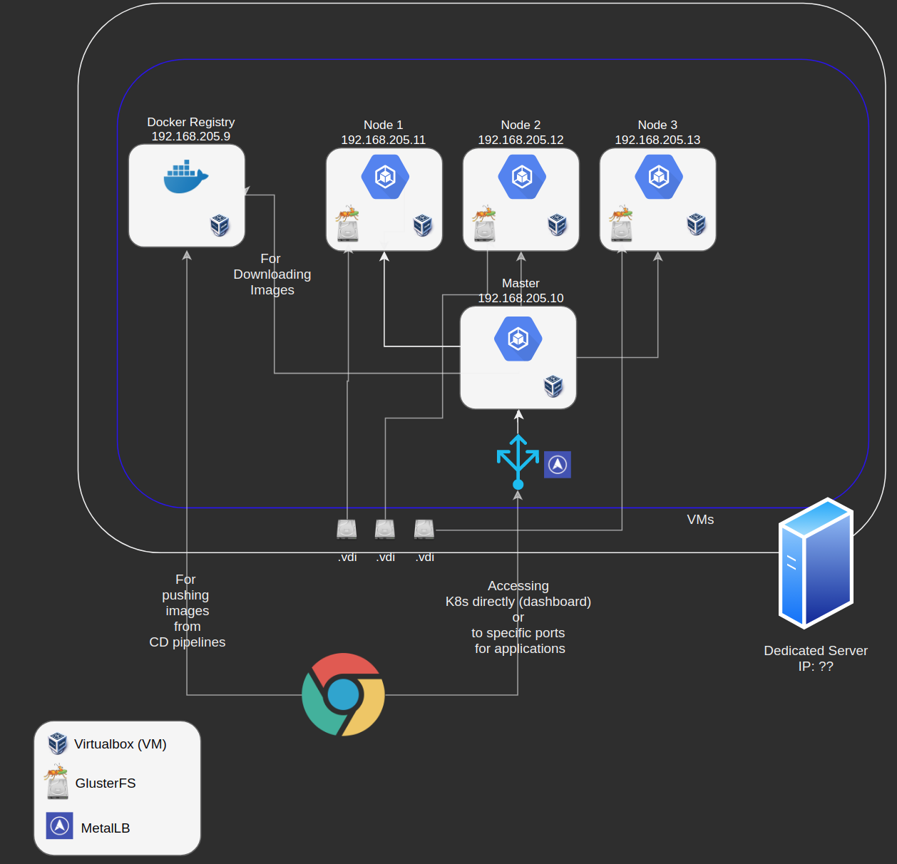

# Kubernetes System

*From now on, Kubernetes will be abbreviated to k8s.*

## GOAL: Install & Deploy full on-premise solution of a k8s cluster

The idea is to install this cluster on a dedicated server, so I had to find a way to virtualize some nodes in order to have a cluster

How this has been achieved:

1) Using [Vagrant](https://www.vagrantup.com/)
    Vagrant helps us scripting the creation of Virtual machines without knowning anything about the used provider (Virtualbox, VMWare, etc)

2) Using VirtualBox as provider, but any of the [providers](https://www.vagrantup.com/docs/providers/) supported by Vagrant can be used

3) Using [CentOS](https://www.centos.org/) as distro for VMs, which is one of the most lightweight distro for enterprise servers

4) using [GlusterFS](https://www.gluster.org/) for the persistence of VMs

5) using [metalLB](https://metallb.universe.tf/) for load-balancing nodes & mapping ips to the outside world

6) Communication between docker-registry, k8s master and nodes is all through SSL and a certificate

### Current Topology of the system

### Flow

1) Once the Dedicated server has been mapped to the DNS, the Docker Registry and k8s master should be accessible from the web.
2) Using our CD pipeline in DevOps, we will build and push docker images to the Docker Regisry, then we will trigger a new deploy on k8s and it will automatically downloads latest images from docker-registry

### Remarks

- not necessarily we need a dedicated server, a Virtual Machine in the cloud would be enough (Yes, a Virtual Machine, with virtualization with Virtualbox, and applications virtualized with docker

- CPU & RAM is completely configurable in the VagrantFile
- Nodes are completely configurable, and you can have as many nodes as we want
- Master node cannot be more than one, for now (See Next Chapter)
- we should backup ONLY the disks of GlusterFS which should contains the data

### Limitations to be analyzed

- (+) We have the VDI disks of GlusterFS to backup, how?
- (+) Docker registry should be backupped, how?
- (-) Only one master node, we should have more to avoid the single point of failure
- (-) As we may have more environment, it's suggested to have ONE docker registry for all of the environments, so the following solutions is preferred

    1) One small VM / dedicated server for docker-registry, public and used by all the company
    2) One dedicated server for each k8s environment

    otherwise

    a big dedicated server which can host one docker-registry and many k8s environments, but then it must be analyzed if it's feasible to map a ip:port to different hostnames, as in this case we will have multiple environments providing a :80 or :443
